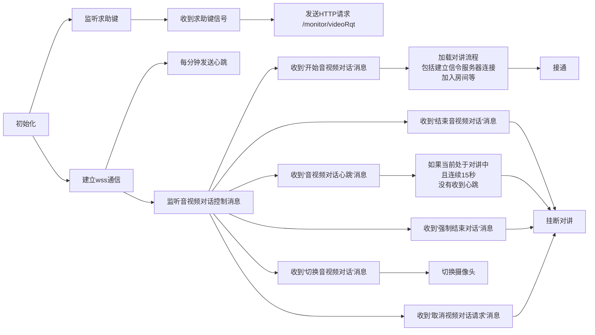

## 主进程

## 技术实现

原有程序基础上：

* 增加晋州专属通话页面

* 配置页面
  * 增加晋州协议选项
  * 如果选择了晋州协议
    * 隐藏：ws连接
    * 增加：
      * 晋州求助http url
      * 晋州websocket url
      * 增加车道号等
    * 跳转对讲的时候不进入原有通话页面，而是晋州新页面
    * 程序启动时需要判断，如果是晋州协议，自动跳转到晋州通话页面，否则还是原有通话页面

* 在background中监听UDP数据包，如果收到了就发送http请求（已实现）

* 在background中建立晋州ws连接，如果收到通话消息了就调用前端方法

